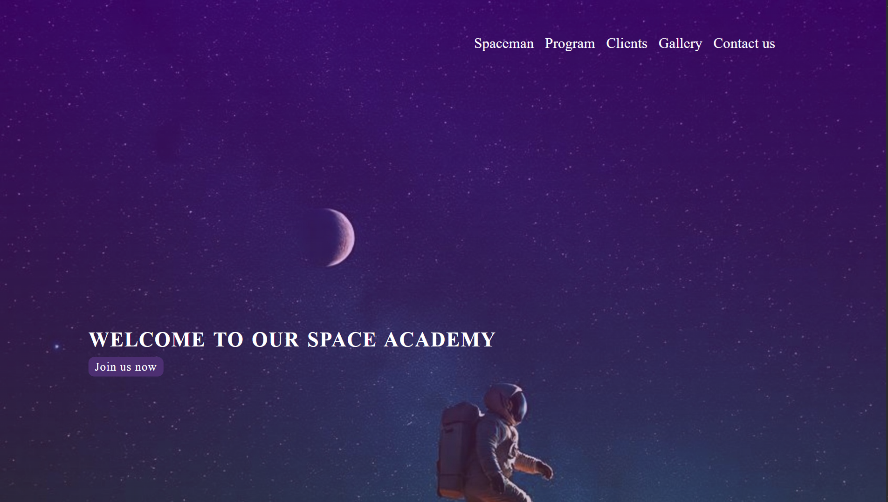
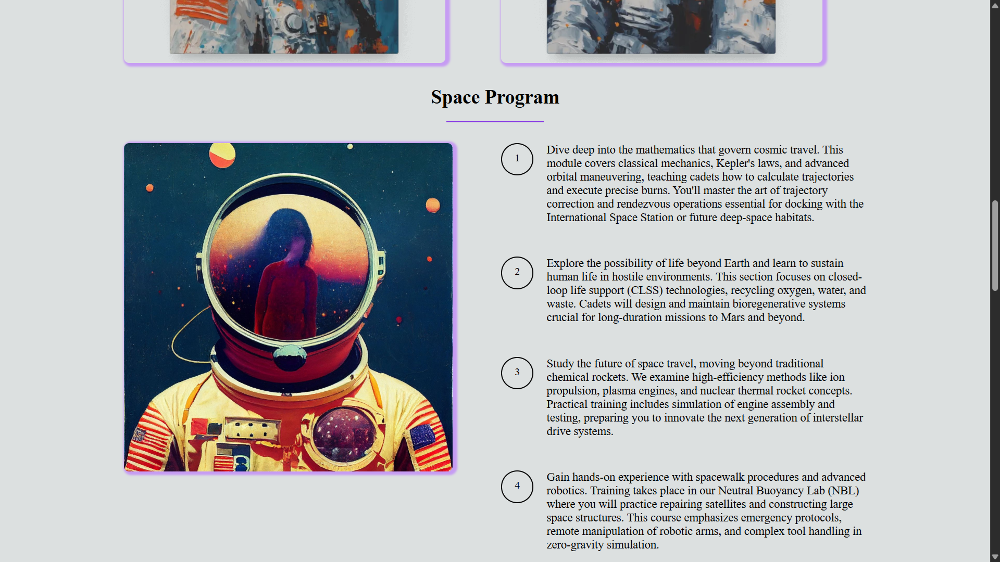
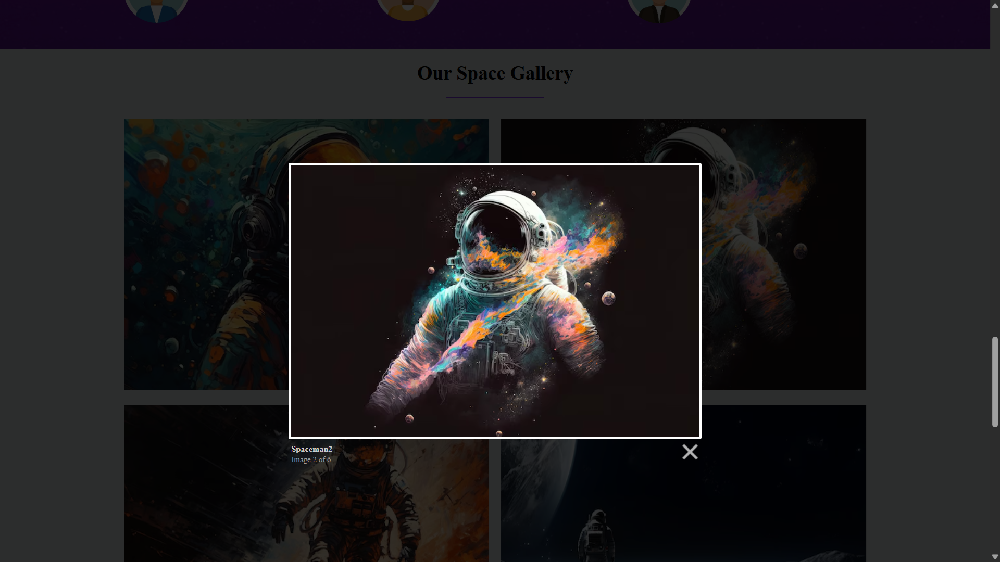
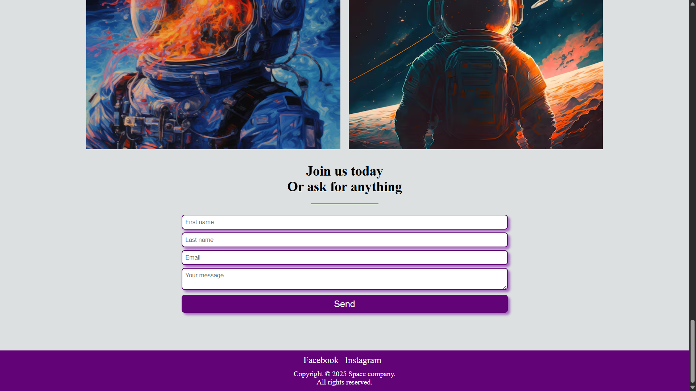

# 🚀 Space Academy Website  
A fictional web project that promotes space travel, astronaut training, and exploration programs.

## Project Structure:

- **HTML5**: Semantic layout with sections for About, Program, Clients, Gallery, and Contact.
- **CSS3**: Custom responsive grid system with media queries for mobile friendliness.
- **JavaScript/jQuery**: Enables lightbox functionality and smooth scroll behavior.
- **Lightbox2**: Enhances the image gallery with a modern overlay experience.

## Features:

- Smooth scrolling navigation  
- Fully responsive grid-based layout  
- Large vertical spacing between sections for better readability  
- Modern header with call-to-action  
- Interactive photo gallery using Lightbox  
- Testimonials section with styled user cards  
- Contact form styled and validated (front-end only)  
- Clean UI/UX with hover transitions and responsive breakpoints  

## Technologies Used:

- HTML5  
- CSS3  
- JavaScript  
- jQuery  
- Lightbox2

## Screenshots
### Index

### Program

### Gallery

### Form
